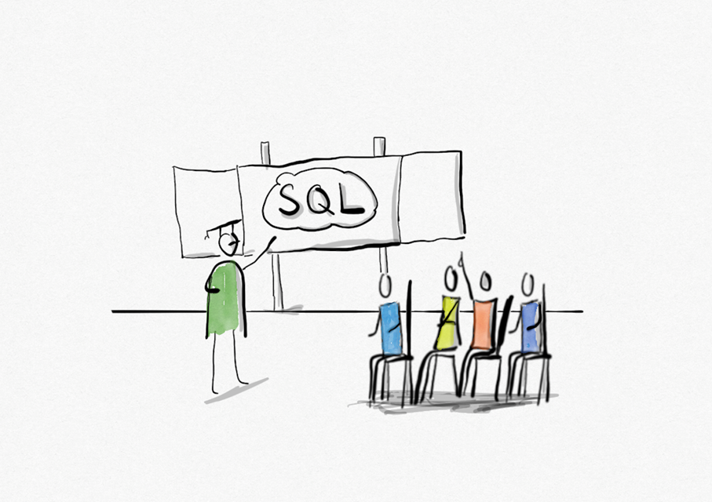

# Idee 

Im LehrplanPLUS der bayrischen Schulen im Fach Informatik wird über alle weiterführenden Schularten hinweg u.a. der Lernbereich Datenbanken thematisiert. Dabei sollen die Schüler\*innen auch lernen Datenbankabfragen mit SQL zu erstellen. Im Prinzip würde hierzu ein einfacher Texteditor reichen, um mit dem Programmieren zu beginnen. Die Erfahrung zeigt aber, dass immer, wenn Schüler\*innen Text zum Erstellen eines Programms schreiben müssen, Syntaxfehler ein großes Problem darstellen. Diese zu finden führt bei Lehrkräften und Schüler*innen schnell zu einer hohen Frustration. Die eigentliche Logik beim Erstellen einer Abfrage mit SQL rückt in den Hintergrund.  

Um im Stil von Scratch mit der Programmierung von SQL Abfragen fortfahren zu können, haben wir recherchiert. Bei unserer Recherche haben wir als fertige Umgebung eigentlich nur [SQL Snap](https://snapextensions.uni-goettingen.de/sqlsnap.html) gefunden, welches wir nicht gerade ansprechend fanden. Gerade das Datenbankhandling dürfte die ein oder andere Lehrkraft hier vor größere Herausforderungen stellen. 

Aus diesem Grund haben wir beschlossen, einen SQL Editor zu entwickeln, der folgende Funktionen mitbringen soll:
- Browserbasiert -> keine Installation notwendig, läuft auch auf mobilen Endgeräten 
- Benötigt kein kompliziertes Datenbanksystem im Hintergrund
- Einfaches austauschen von Datenbanken (SQLite) möglich
- Einfach zu bedienende Oberfläche, welche ohne viel Texteingabe auskommt
- Integrierte Lernumgebumg, um Lernenden Aufgabenstellungen, Rätsel oder Breakouts zur Verfügung zu stellen
- Schüler\*innen gerechte Dokumentation
- Autorenwerkzeug zum Erstellen von Aufgaben, Rätseln oder Breakouts